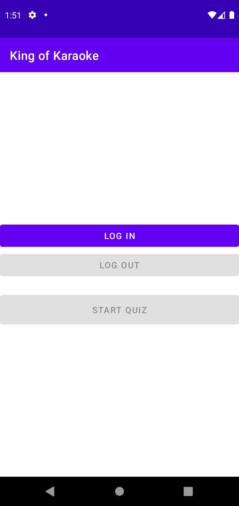
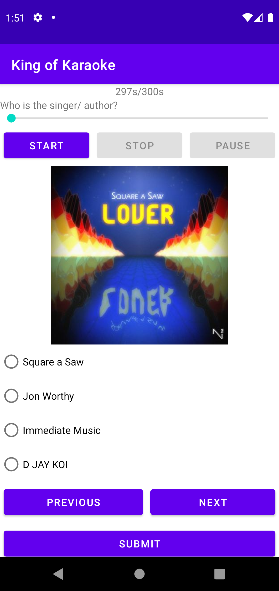
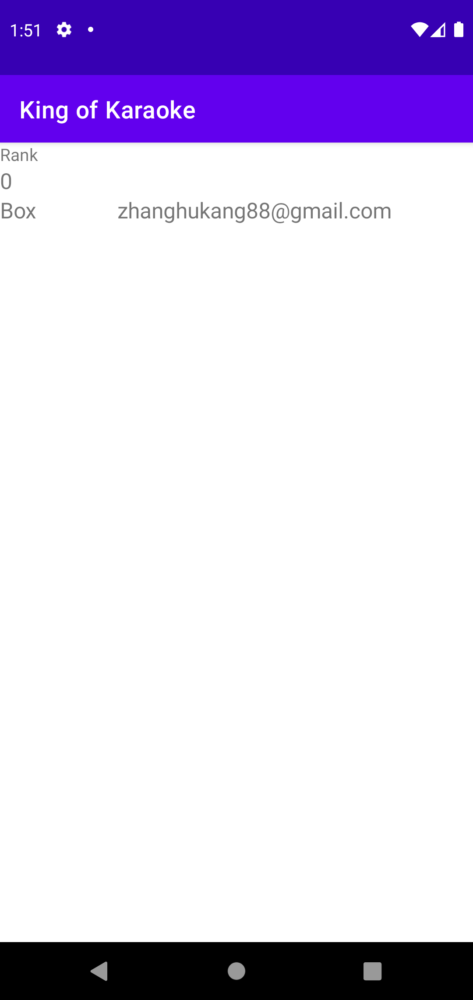
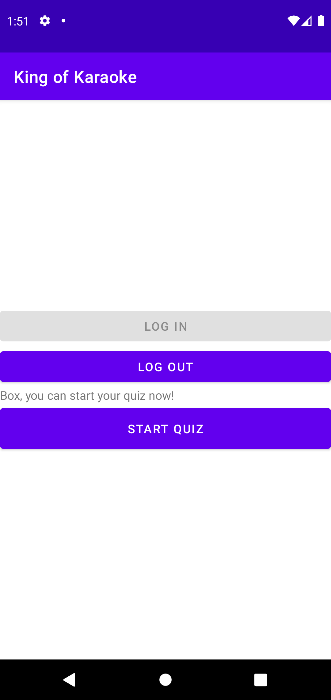
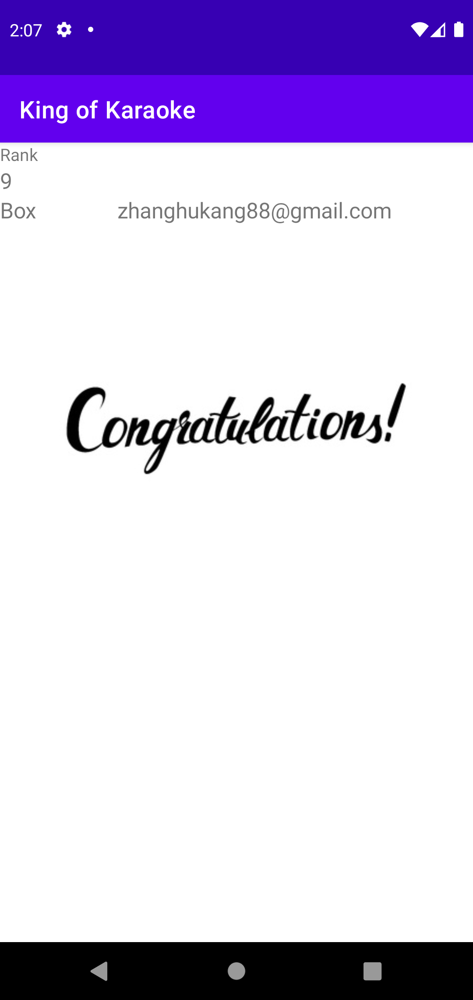
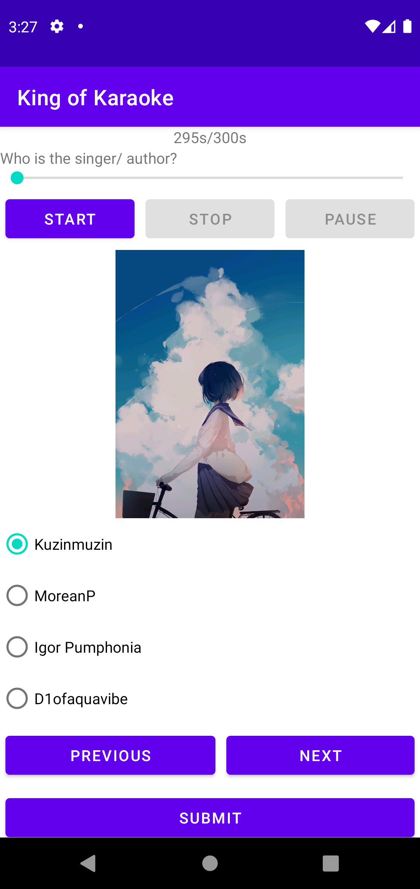
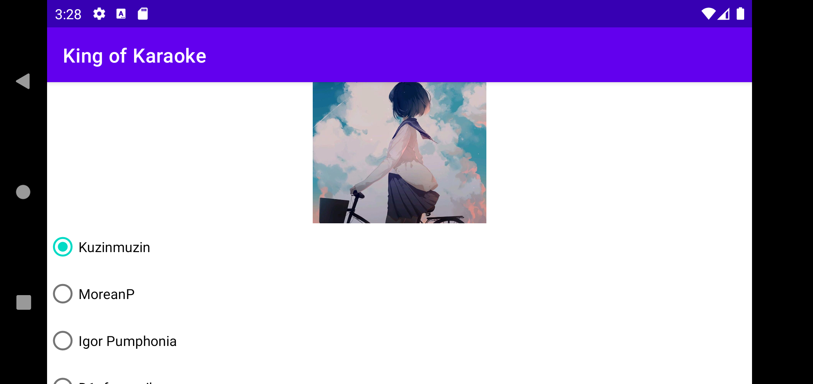

# Course Project-CISC3002
ZHANG HUAKANG/ DB927606

---
## Introduction
This application named *King of Karaoke* is a quiz game about music. Users will login in with their account(they can use Google Account), answer a number of question which are randomly slected from a questions library within the specified time, finally submit their score to the server and let other users know their grade. 

In this project, I use **Java** and **Android SDK** to develop the front-end application. As for the back end which is used to store data, I use **Python** and **Django Framework** to develop it.

Since the course focuses on Android application development, I will not go into details about the specific implementation of the back-end.  The source code of the whole project and other data used in this was upload to **[Github](https://github.com/BoxMars/AndroidDevCourseProject)**. 

---
## Details
### Login/ Loutout
This part uses a third-party services named **[Auth0](https://auth0.com/)** to implement. When user click the button to login or lognout.

<!-- ```Java
Auth0 auth0=new Auth0();

private void login(){
    WebAuthProvider.login(auth0)
        .withScheme("demo")
        .withAudience(String.format("https://%s/userinfo", getString(R.string.com_auth0_domain)))
        .start(this, new Callback<Credentials, AuthenticationException>() {
            @Override
            public void onSuccess(Credentials credentials) {
                /*
                * get user's info and store them.
                */
            }

            @Override
            public void onFailure(AuthenticationException e) {}
        });

    }

private void logout() {
    WebAuthProvider.logout(auth0)
        .withScheme("demo")
        .start(this, new Callback<Void, AuthenticationException>() {
            @Override
            public void onSuccess(@Nullable Void payload) {
                /*
                * clear the user's data.
                */
            }

            @Override
            public void onFailure(@NonNull AuthenticationException error) {}
        });

}
``` -->

When user click *Login* button, *Auth0* will bring up a browser window.

<div  align="center">    
    
</div>


After the user login successfully, the application will get the username and the email which will be stored and the email will be used as the unique identification information of the scoring system.

### Update the data library
When the application starts, it will send a request to the server and get the latest version number of the songs library ([VERSION_API](https://cisc3002api.boxz.dev/version)). At the same time, it will also get the version information stored locally. If those two version number are different, the application will call a new *Activity* with dialog theme to ask the user whether to update the information. If user choose *Yes*, the application will request the songs infomation in `JSON` ([SONGS_API](https://cisc3002api.boxz.dev/songs)), like this:

```json
[
    {
        "song": "Chocolate", 
        "singer": "Alfonso Lugo", 
        "songURL": "https://github.com/BoxMars/AndroidDevCourseProject/raw/master/static/Alfonso_Lugo_-_Chocolate.mp3"
    }, 
    {
        "song": "Study and Relax",
        "singer": "D JAY KOI", 
        "songURL": "https://github.com/BoxMars/AndroidDevCourseProject/raw/master/static/D_JAY_KOI_-_HOUSE_PARTY_._Feat_Fil_Straughan__.mp3"
    }, 
    ...
    ...
    ...
]
```
Those infomation will be stored in application's internal storage. A `DownloadAsynTask` will start to download all music and sotre them in internal storage.

<div  align="center">    
    
</div>

### Quiz
The Quiz activeity consists of five parts. On the top there is a *countdown timer*. Under the coundown timer is the *music player* part and the *cover image* of the music. Then, there are four radio button and three button, *Previous*, *Next*, and *Submit*.
<div  align="center">    
    
</div>
Every question are chosen from question library randomly, and the option of each question are also randomly generated. 

The function that several questions can be swiped on the screen is implemented by `ViewPage2` and `Fragment`. The two buttons at the boottom can also be used to browse between different questions.

#### Countdown Timer
User can submit his/her answers before within the specified time, or answers are automatically submitted, when time runs out. The function which will be called when the time is up:
```Java
countDownTimer=new CountDownTimer(300000,1000) {
    @Override
    public void onTick(long millisUntilFinished) {
        TextView textView=findViewById(R.id.timerTextView);
        textView.setText(millisUntilFinished/1000+"s/300s");
    }

    @Override
    public void onFinish() {
        Intent intent1=new Intent();
        intent1.setClass(getApplicationContext(),ScoreActivity.class);
        startActivity(intent1);
    }
};
countDownTimer.start();
```

#### Music Player
It has three function: *Start*, *Pause* and *Stop* to control the music playing.
<div  align="center">    
    
</div>
The first image shows the music is stopped or not started. The second image shows that the music is paused after starting.

The cover image are directly from MP3 file's metadata. I use `MediaMetadataRetriever` to decode the infomation and show it on the screen.

```Java
MediaMetadataRetriever mmr = new MediaMetadataRetriever();
mmr.setDataSource(String.valueOf(new File(getActivity().getFilesDir(),"mp3 file name")));
byte [] data = mmr.getEmbeddedPicture();
Bitmap bitmap = BitmapFactory.decodeByteArray(data, 0, data.length);
imageView.setImageBitmap(bitmap);
```
When the music starts, there will be a halder to get the current music playback progress and pass the data to seekbar.
```Java
Handler handler=new Handler(Looper.myLooper());
Runnable runnable=new Runnable() {
    @Override
    public void run() {
        if(mediaPlayer!=null)
        {
            seekBar.setProgress(mediaPlayer.getCurrentPosition());
            handler.postDelayed(this, 200);
        }
    }
};
mediaPlayer.start();
seekBar.setMax(mediaPlayer.getDuration());
handler.postDelayed(runnable,200);
```
#### Previous and Next button
The butttons *Previous* and *Next* are in the `Fragment`, when they are clicked, system will call the following function：

```Java
ViewPager2 viewPager2=getActivity().findViewById(R.id.viewPage);
nextBtn.setOnClickListener(new View.OnClickListener() {
    @Override
    public void onClick(View v) {
        if (viewPager2.getCurrentItem()<Question.questionArrayList.size()) {
            viewPager2.setCurrentItem(viewPager2.getCurrentItem() + 1, true);
        }
    }
});

previousBtn.setOnClickListener(new View.OnClickListener() {
    @Override
    public void onClick(View v) {
        if (viewPager2.getCurrentItem()>0) {
            viewPager2.setCurrentItem(viewPager2.getCurrentItem() - 1, true);
        }
    }
});
```

#### Submit button
When user click the submit button or the time is up, the apllication will bring up the `Score` activity and beacuse the `Quiz` activety's lunch mode is  `singleInstance` which means that when user click `back` button in `Score` activity, he/her will come back to the `Login/Logout` activety to start a new quiz or logout instead of `Quiz` activity.

<div  align="center">    
    
    
</div>

### Score
When user click the `Submit` button in `Quiz` activety, the `Score` activity will be called. At the begin of the activity starts,the application will calculate the user's score and send the result to the server by the API (`SUBMIT_API` : https://API_SERVER/submitrank/?username=test&email=test@test.com&score=8). Then the application will request to get the record of all users by [GETRANK_API](http://cisc3002api.boxz.dev/getrank). The following `JSON` data is an example:
```JSON
[
    {
        "username": "Box", 
        "email": "test@gmail.com", 
        "score": 0
    }
    ...
    ...
]
```
After getting response, the application will sort the data according to the score and display them in the user interface in order from high to low. In particular, the font size of the current user’s information is larger. If user get full mark, a congratulation image will be shown.
<div  align="center">    
    
    
</div>
The sorting implementation:

```Java
for (int i = 0; i < users.size()-1; i++) {
    for (int j = i+1; j < users.size(); j++) {
        if (users.get(j).getScore()>users.get(i).getScore()){
            User t=users.get(j);
            users.set(j,users.get(i));
            users.set(i,t);
        }
    }
}
```
---

## Some implementations 

### The randomly selection of questions
After the data is stored in memory, 
```Java
ArrayList<Question> questionArrayList=new ArrayList<>();
Random random=new Random();
while (questionArrayList.size()<=Math.min(8,Question.questionArrayList.size())){
    int  result=random.nextInt(Question.questionArrayList.size());
    if (!questionArrayList.contains(Question.questionArrayList.get(result))){
        questionArrayList.add(Question.questionArrayList.get(result));
    }
}
Question.questionArrayList=questionArrayList;
Question.generateOption();
```

```Java
public static void generateOption(){
    isCorrectList=new ArrayList<>();
    userAnswer=new ArrayList<>();
    for (int i = 0; i < questionArrayList.size(); i++) {
        ArrayList<Integer> options=new ArrayList<>();
        Random random=new Random();
        while(options.size()<=3){
            int result=random.nextInt(questionArrayList.size());
            if (result!=i&&!options.contains(result)){
                options.add(result);
            }
        }
        int result=random.nextInt(4);
        options.add(result,i);
        questionArrayList.get(i).setOptions(options);
        questionArrayList.get(i).setAnswer(result);
        isCorrectList.add(false);
        userAnswer.add(4);
    }
}
```
the application will ramdomly select 8 question and generate each question's option. The main code is :
```Java
 while(options.size()<=3){
    int result=random.nextInt(questionArrayList.size());
    if (result!=i&&!options.contains(result)){
        options.add(result);
    }
}
```
Due to the small scale, the speed is very fast.

### Rotation of phone
Due to the characteristics of the *Java Virtual Machine*, the static variables in the class will always exist from the time the class is loaded to the end of the program. Thus, I did not use *ViewModel* but chose to set all the variables that need to be used throughout the life cycle of the program into static variables, which menas no matter how the program status changes, all data is correctly stored and displayed before the program ends. The following code is an example:
```Java
public class Question implements Serializable {
    public static ArrayList<Question> questionArrayList=new ArrayList<>();
    public static ArrayList<Integer> userAnswer=new ArrayList<>();
    public static ArrayList<Boolean> isCorrectList=new ArrayList<>();
}
```
The questions, anwsers are ststic variables. So, when user rotates his/her phone in `Quiz` Activity, the user's answers and the order of the questions will no change.
<div  align="center">    
    
</div>
<div  align="center">
    
</div>

### Handling of Exceptions